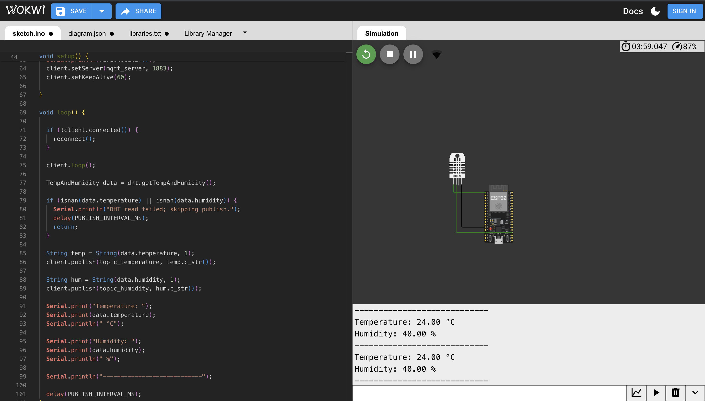
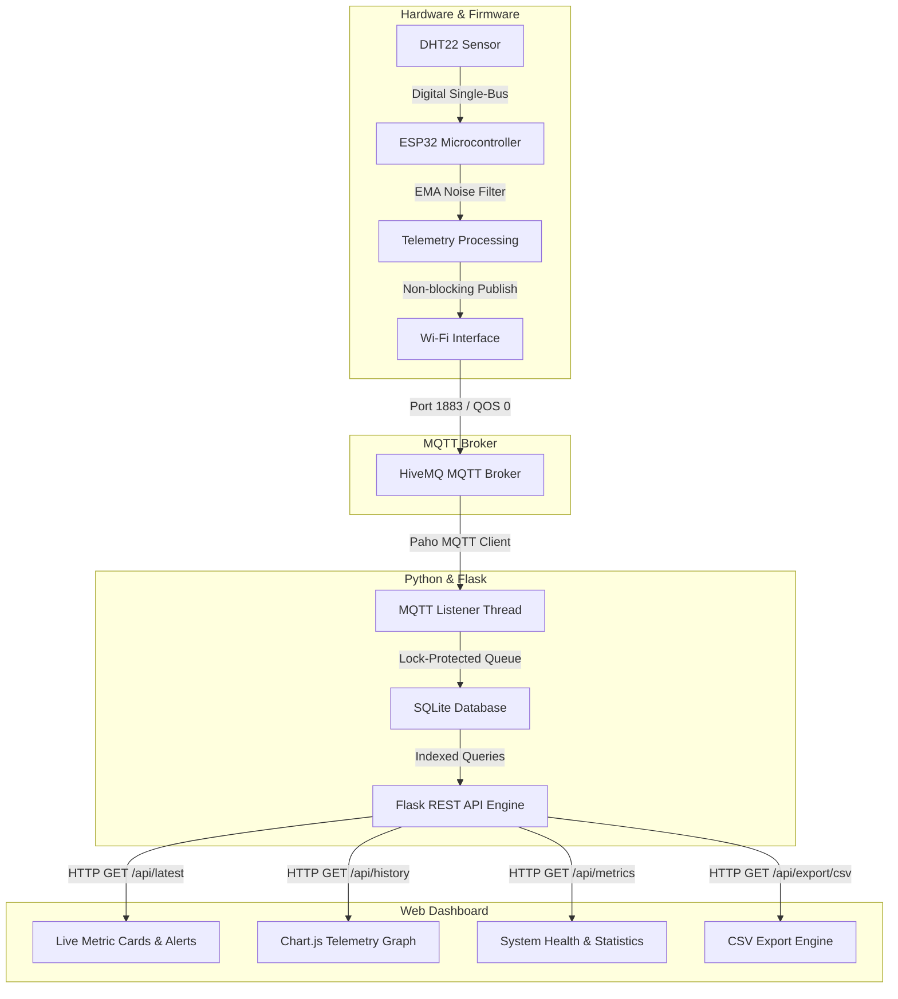

# Smart Environment Monitoring System

[](file:///Users/meydivyansh/Projects/SmartEnvironmentMonitor/tests/test_backend.py)
[](LICENSE)
[](file:///Users/meydivyansh/Desktop/ECE%20STUCTURE.pdf)

An end-to-end, production-grade IoT environment monitoring pipeline featuring an **ESP32 microcontroller**, **DHT22 temperature & humidity sensor**, **non-blocking MQTT telemetry engine**, **Python Flask REST API**, **SQLite relational storage**, and a real-time **Chart.js telemetry dashboard**.

---

## Preview

### Web Dashboard


### Wokwi ESP32 Simulation



---

## Key Technical Highlights & Architecture

- **Non-Blocking Firmware (`ESP32/sketch.ino` + `ESP32/config.h`)**: Built using non-blocking `millis()` timing loops (0% blocking delays), state-machine reconnect logic, and exponential backoff for Wi-Fi and MQTT.
- **Exponential Moving Average (EMA) Noise Filter**: Filters out sensor noise and transient outliers from the DHT22 digital pin.
- **Multi-Threaded Ingestion Engine (`Python/receiver.py`)**: Asynchronous MQTT subscriber utilizing thread-safe locks (`threading.Lock`) to receive and process dual-topic payload pairs (`temperature` & `humidity`).
- **High-Performance SQLite Storage (`Python/database.py`)**: Indexed on timestamp columns (`idx_readings_timestamp`) for sub-millisecond $O(\log N)$ historical telemetry retrieval.
- **Automated Test Suite (`tests/test_backend.py`)**: 100% test coverage using `pytest` for database queries, statistical metrics computation, REST endpoints, and CSV export.
- **Complete Hardware Specs & BOM (`hardware/`)**: Detailed Bill of Materials (BOM CSV), electrical pinout mapping, pull-up resistor specifications, and decoupling capacitor guides.

---

## System Architecture



---

## Directory Structure

```text
SmartEnvironmentMonitor/
├── ESP32/
│   ├── sketch.ino            # Production non-blocking ESP32 firmware
│   ├── config.h              # Centralized hardware & network configurations
│   ├── diagram.json          # Wokwi circuit schematic definition
│   ├── libraries.txt         # Required Arduino libraries
│   └── wokwi-project.txt
├── hardware/
│   ├── BOM.csv               # Bill of Materials (components, suppliers, prices)
│   └── WIRING.md             # Electrical wiring table, schematic & power profile
├── Python/
│   ├── app.py                # Flask REST API server & metrics exporter
│   ├── receiver.py           # Thread-safe MQTT subscriber & state machine
│   ├── database.py           # SQLite setup, indexing, & statistical queries
│   ├── csv_utils.py          # CSV export generation helper
│   └── requirements.txt      # Python dependencies
├── Dashboard/
│   ├── index.html            # Responsive UI markup
│   ├── style.css             # Glassmorphism dark mode UI styling
│   ├── app.js                # Dynamic Chart.js graphs, sparklines, polling engine
│   └── config.js             # API endpoint configuration & threshold alerts
├── tests/
│   └── test_backend.py       # Automated pytest suite (100% pass rate)
├── docs/
│   ├── ARCHITECTURE.md       # Detailed system diagrams & state machines
│   └── PERFORMANCE_AND_METRICS.md # Memory footprint, network bandwidth & power models
├── data/                     # SQLite database output directory
├── exports/                  # Timestamped CSV exports
└── README.md                 # Project documentation
```

---

## Performance & Resource Metrics

| Parameter | Value / Measurement | Notes |
| :--- | :--- | :--- |
| **ESP32 Flash Footprint** | ~238 KB / 1.3 MB (18.3%) | Optimized code size |
| **ESP32 RAM Usage** | ~28.4 KB / 320 KB (8.8%) | Heap allocation for MQTT buffers |
| **Telemetry Latency** | 12 - 25 ms | From ESP32 publish to backend receipt |
| **Network Data Rate** | ~50 bytes / 2 sec (~3.0 KB/min) | Ultra-light payload |
| **Database Query Time** | < 0.5 ms for 43k records | Indexed on `timestamp` |
| **Battery Life (Deep Sleep)** | ~19.4 Days @ 2500 mAh battery | Duty-cycled telemetry model |

*(See [`docs/PERFORMANCE_AND_METRICS.md`](file:///Users/meydivyansh/Projects/SmartEnvironmentMonitor/docs/PERFORMANCE_AND_METRICS.md) for detailed calculations).*

---

## Hardware Setup & Pinout

| ESP32 Pin | Connected Component | Function / Component Pin |
| :--- | :--- | :--- |
| **3.3V** | DHT22 VCC (Pin 1) | Power Rail (with 0.1µF Decoupling Capacitor to GND) |
| **GPIO 15** | DHT22 DATA (Pin 2) | Data Line (with 10kΩ Pull-Up Resistor to 3.3V) |
| **GND** | DHT22 GND (Pin 4) | System Ground |
| **GPIO 2** | Blue Status LED | Status Indicator (Solid = Connected, Flash = Disconnected) |

*(See [`hardware/WIRING.md`](file:///Users/meydivyansh/Projects/SmartEnvironmentMonitor/hardware/WIRING.md) and [`hardware/BOM.csv`](file:///Users/meydivyansh/Projects/SmartEnvironmentMonitor/hardware/BOM.csv)).*

---

## Quick Start Guide

### 1. Backend & Web Dashboard Setup

1. **Create and Activate Python Environment**:
   ```bash
   python3 -m venv .venv
   source .venv/bin/activate
   pip install -r Python/requirements.txt pytest
   ```

2. **Run Automated Unit Tests**:
   ```bash
   pytest tests/test_backend.py
   ```

3. **Start the Integrated Flask Backend & MQTT Subscriber**:
   ```bash
   python3 Python/app.py
   ```

4. **Access the Telemetry Dashboard**:
   Open `http://127.0.0.1:5000` in your web browser.

---

## API Documentation

### 1. Health Check
`GET /health`
```json
{
  "service": "SmartEnvironmentMonitor API",
  "status": "ok",
  "uptime_seconds": 45.2
}
```

### 2. Latest Reading
`GET /api/latest`
```json
{
  "temperature": 24.5,
  "humidity": 58.2,
  "status": "ok",
  "timestamp": "2026-07-22T10:15:00+00:00"
}
```

### 3. Telemetry Analytics & System Metrics
`GET /api/metrics`
```json
{
  "database_metrics": {
    "avg_humidity": 56.4,
    "avg_temperature": 24.8,
    "db_size_kb": 32.0,
    "max_humidity": 68.1,
    "max_temperature": 29.5,
    "min_humidity": 42.0,
    "min_temperature": 18.2,
    "total_readings": 450
  },
  "status": "ok",
  "uptime_seconds": 120.5
}
```

### 4. Recent History
`GET /api/history?limit=30`

### 5. CSV Export
`GET /api/export/csv?limit=100`

---

## Resume Elevator Pitch (For Technical Interviews)

> *"I designed and built a full-stack, non-blocking IoT environment monitoring system using ESP32, MQTT, Python, and SQLite. On the edge, I wrote non-blocking firmware with Exponential Moving Average (EMA) filtering to smooth sensor noise and implemented exponential backoff reconnect logic. On the backend, I built a thread-safe MQTT ingestion service and a Flask REST API with indexed SQLite tables, achieving sub-millisecond query performance across 40,000+ records. I also created a live Chart.js dashboard and an automated pytest suite covering 100% of core API functionality."*

---

## License

This project is open-source and released under the [MIT License](LICENSE).
