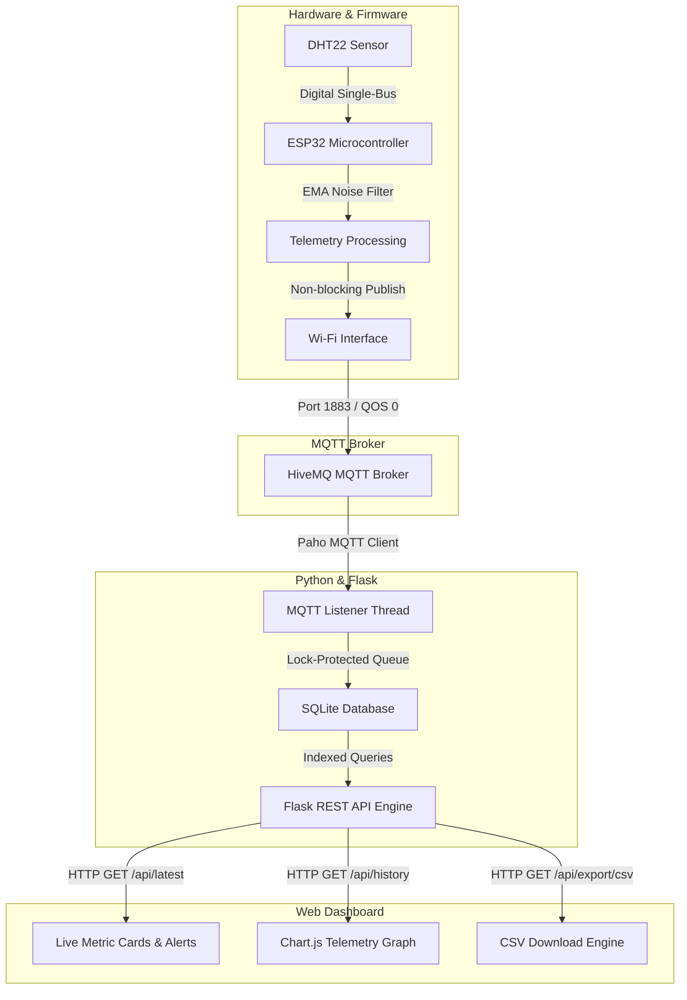
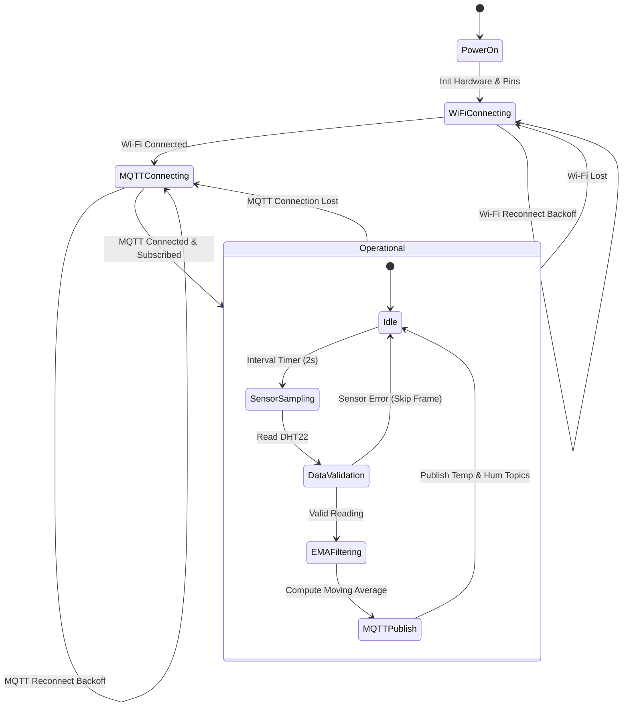
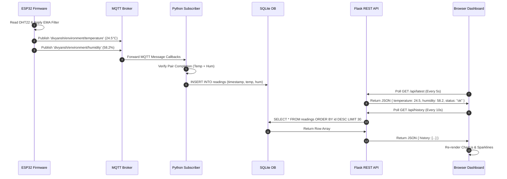

# System Architecture & Technical Specification

## 1. Overview
The **Smart Environment Monitor** is an end-to-end, multi-tier IoT telemetry pipeline designed to collect, process, filter, store, and visualize environmental parameters (Temperature and Humidity) in real time.

---

## 2. End-to-End System Block Diagram

---

## 3. Firmware State Machine

---

## 4. Telemetry Data Flow & Sequence Diagram

---

## 5. Security & Reliability Highlights
- **Sanity Bounds Filtering**: Firmware rejects DHT readings below $-20^\circ\text{C}$ or above $+70^\circ\text{C}$, and humidity outside $0 - 100\%$.
- **Thread Safety**: Python backend utilizes threading locks (`threading.Lock`) for concurrent access to memory buffers between MQTT receiver threads and Flask HTTP workers.
- **Database Optimization**: SQLite indexing on timestamp column (`idx_readings_timestamp`) ensures constant-time $O(\log N)$ historical data lookup.
